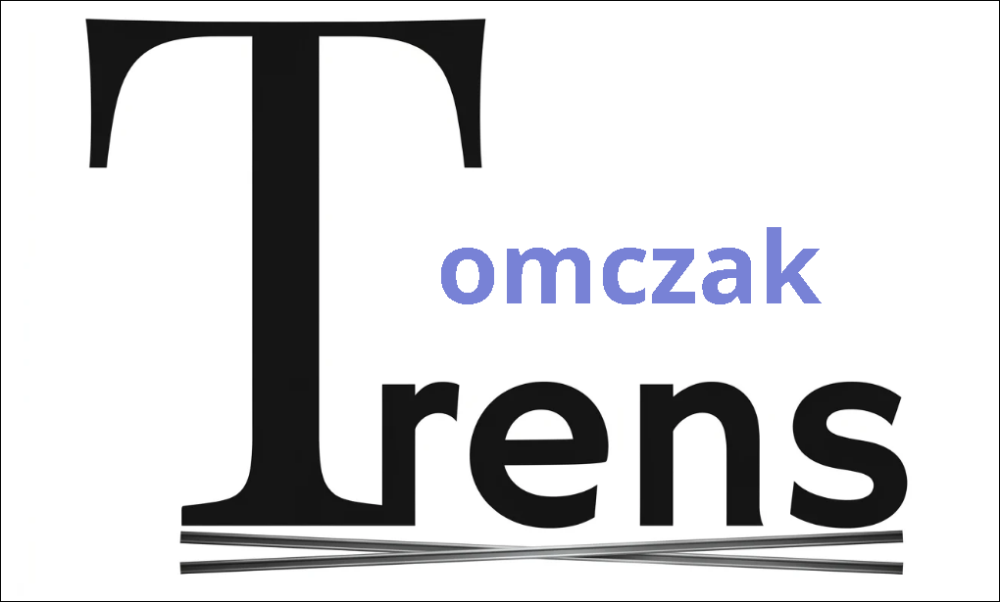

## Este site está sendo desenvolvido em função de uma Situação de Aprendizagem por:

-  #### Caio Luiz Borba;
-  #### Matheus Tomczak;
-  #### Felipe Zuquetti Pereira;
-  #### Henrique Lombardi.

## Função

O sistema tem como principal objetivo realizar o monitoramento em tempo real dos dados coletados pelos sensores IoT instalados na locomotiva e nos trilhos ferroviários, permitindo maior controle operacional, segurança e eficiência no transporte ferroviário. Porem no momento a atividade tem como foco principal apenas uma parte visual do sistema

A plataforma será responsável por receber, processar e exibir informações importantes enviadas pelos sensores, como temperatura do motor, pressão do óleo, velocidade da locomotiva, frenagem, rotação do motor, nível de combustível, vibração dos trilhos, integridade da via férrea, temperatura dos trilhos e carga por eixo.

O sistema também terá a função de identificar possíveis falhas, riscos ou comportamentos anormais nos componentes da locomotiva e na estrutura ferroviária, emitindo alertas automáticos para auxiliar na prevenção de acidentes, falhas mecânicas e problemas operacionais.

Além do monitoramento em tempo real, a plataforma contará com funcionalidades de armazenamento e gerenciamento de dados, permitindo o cadastro de usuários, sensores e locomotivas, bem como a geração de relatórios analíticos para análise de desempenho, manutenção preventiva e tomada de decisões.

A interface do sistema será moderna, responsiva e organizada, facilitando a visualização das informações e garantindo uma experiência intuitiva para os usuários. O sistema será utilizado principalmente por administradores, operadores ferroviários e equipes técnicas responsáveis pelo monitoramento e manutenção da operação ferroviária, sempre priorizando a segurança, confiabilidade e eficiência da locomotiva e da malha ferroviária.

## Visual

Na nossa logo, optamos por uma mensagem simples e direta, algo que não ocupasse  tempo, mas que fosse marcante 
o suficiente para lembrar. O tema principal do sistemas são os Trens então, usamos a inicial “T” como elemento 
principal, e a conectamos com o nome de um dos fundadores e um querido membro da nossa equipe, o Tomczak, usando 
o “T” como inicial de ambos, e diferenciando o “omczak” com a cor de identidade da marca, facilitando o 
entendimento do cliente e fazendo uma rápida e eficaz associação das duas coisas.

## Desenvolvimento

Para uma boa organização, este projeto conta com um video de apresentação das funções de cada membro do grupo, e sobre possiveis mudanças ou funcionalidades em desenvolvimento:

- [Link do video explicativo e extremamente legal] ( https://drive.google.com/file/d/1D3_xM4opO2J9nc-3J7p02BV_X7f0zz1o/view?usp=drive_link )
- [Video]<video controls src="Reunião do Projeto Ferrorama.mp4" title="Title">Video Magnifico</video>

